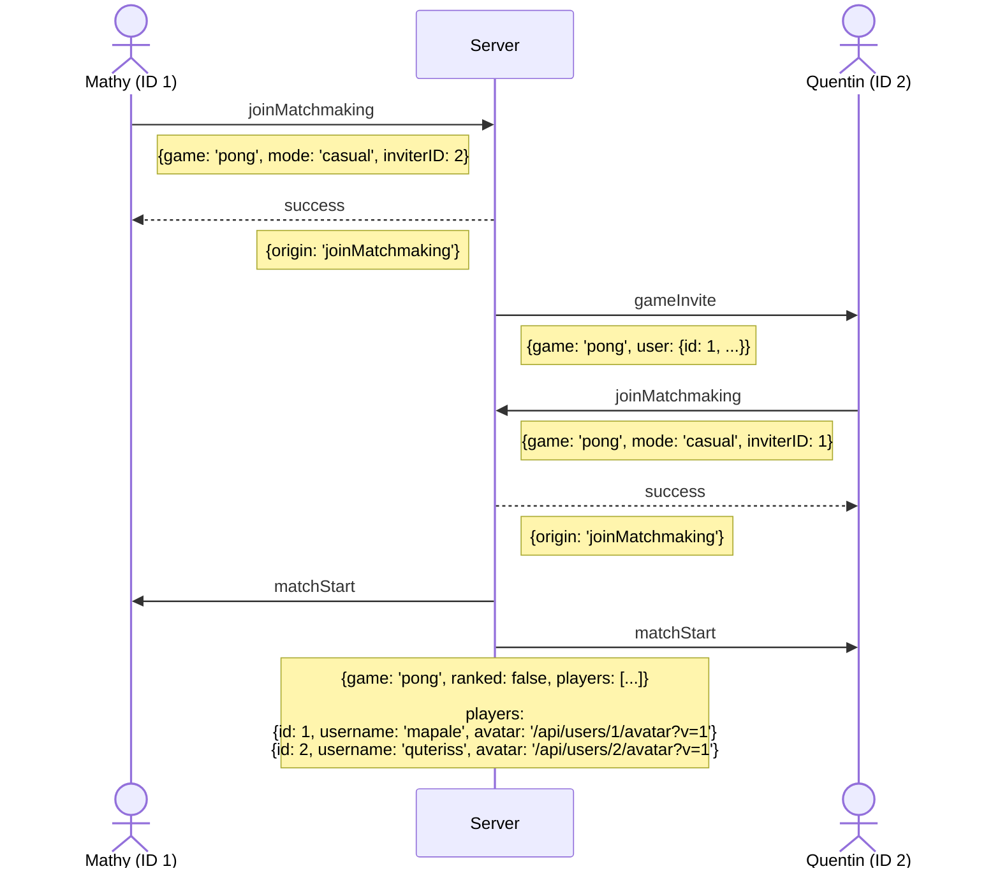

# Game Invite

```mermaid
sequenceDiagram
  actor m as Mathy (ID 1)
  participant s as Server
  actor q as Quentin (ID 2)

  m ->> s: joinMatchmaking
  Note right of m: {game: 'pong', mode: 'casual', inviterID: 2}
  s -->> m: success
  Note left of s: {origin: 'joinMatchmaking'}
  s ->> q: gameInvite
  Note right of s: {game: 'pong', user: {id: 1, ...}}

  q ->> s: joinMatchmaking
  Note left of q: {game: 'pong', mode: 'casual', inviterID: 1}
  s -->> q: success
  Note right of s: {origin: 'joinMatchmaking'}

  s ->> m: matchStart
  s ->> q: matchStart
  Note over s: {game: 'pong', ranked: false, players: [...]}<br><br> players:<br>{id: 1, username: 'mapale', avatar: '/api/users/1/avatar?v=1'}<br>{id: 2, username: 'quteriss', avatar: '/api/users/2/avatar?v=1'}
```
