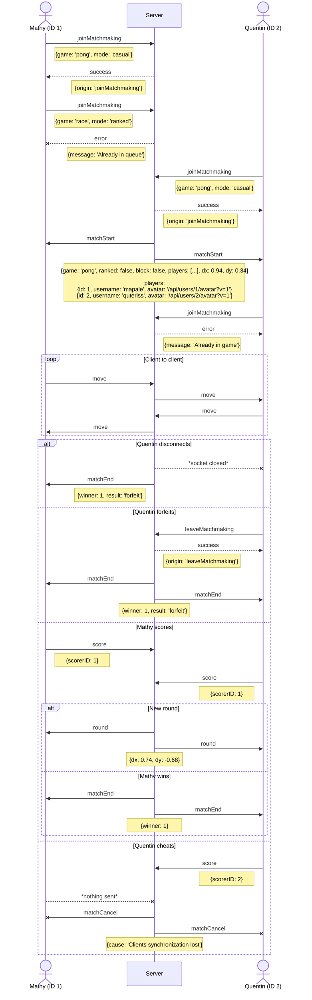

# Match proceeding

```mermaid
sequenceDiagram
  actor m as Mathy (ID 1)
  participant s as Server
  actor q as Quentin (ID 2)

  m ->> s: joinMatchmaking
  Note right of m: {game: 'pong', mode: 'casual'}
  s -->> m: success
  Note left of s: {origin: 'joinMatchmaking'}

  m ->> s: joinMatchmaking
  Note right of m: {game: 'race', mode: 'ranked'}
  s --x m: error
  Note left of s: {message: 'Already in queue'}

  q ->> s: joinMatchmaking
  Note left of q: {game: 'pong', mode: 'casual'}
  s -->> q: success
  Note right of s: {origin: 'joinMatchmaking'}

  s ->> m: matchStart
  s ->> q: matchStart
  Note over s: {game: 'pong', ranked: false, block: false, players: [...], dx: 0.94, dy: 0.34}<br><br> players:<br>{id: 1, username: 'mapale', avatar: '/api/users/1/avatar?v=1'}<br>{id: 2, username: 'quteriss', avatar: '/api/users/2/avatar?v=1'}

  q ->> s: joinMatchmaking
  s -->> q: error
  Note right of s: {message: 'Already in game'}

  loop Client to client
    m ->> s: move
    s ->> q: move
    q ->> s: move
    s ->> m: move
  end

  alt Quentin disconnects
    s --x q: *socket closed*
    s ->> m: matchEnd
    Note left of s: {winner: 1, result: 'forfeit'}

  else Quentin forfeits
    q ->> s: leaveMatchmaking
    s -->> q: success
    Note right of s: {origin: 'leaveMatchmaking'}
    s ->> m: matchEnd
    s ->> q: matchEnd
    Note over s: {winner: 1, result: 'forfeit'}

  else Mathy scores
    m ->> s: score
    Note right of m: {scorerID: 1}
    q ->> s: score
    Note left of q: {scorerID: 1}

    alt New round
      s ->> m: round
      s ->> q: round
      Note over s: {dx: 0.74, dy: -0.68}
    else Mathy wins
      s ->> m: matchEnd
      s ->> q: matchEnd
      Note over s: {winner: 1}
    end

  else Quentin cheats
    q ->> s: score
    Note left of q: {scorerID: 2}
    m --x s: *nothing sent*
    s -x m: matchCancel
    s -x q: matchCancel
    Note over s: {cause: 'Clients synchronization lost'}
  end
```
