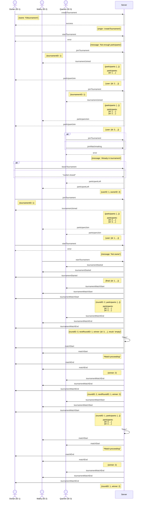

# Tournament proceeding

```mermaid
sequenceDiagram
  actor d as Dorian (ID 1)
  actor m as Mathy (ID 2)
  actor q as Quentin (ID 3)
  participant s as Server

  d ->>+ s: createTournament
  Note right of d: {name: 'Kittournament'}
  s -->>- d: success
  Note left of s: {origin: 'createTournament'}

  d ->>+ s: startTournament
  s --x- d: error
  Note left of s: {message: 'Not enough participants'}

  m ->>+ s: joinTournament
  Note right of m: {tournamentID: 1}
  s -->> m: tournamentJoined
  Note left of s: {participants: [...]}<br><br>participants:<br>{id: 1, ...}
  s -->>- d: participantJoin
  Note left of s: {user: {id: 2, ...}}

  q ->>+ s: joinTournament
  Note right of q: {tournamentID: 1}
  s -->> q: tournamentJoined
  Note left of s: {participants: [...]}<br><br>participants:<br>{id: 1, ...}<br>{id: 2, ...}
  s -->> m: participantJoin
  s -->>- d: participantJoin
  Note left of s: {user: {id: 3, ...}}

  alt
    q ->>+ s: joinTournament
  else
    q ->> s: joinMatchmaking
  end
  s --x- q: error
  Note left of s: {message: 'Already in tournament'}

  alt
    d ->>+ s: leaveTournament
  else
    d --x s: *socket closed*
  end
  s -->> q: participantLeft
  s -->>- m: participantLeft
  Note left of s: {userID: 1, ownerID: 2}

  d ->>+ s: joinTournament
  Note right of d: {tournamentID: 1}
  s -->> d: tournamentJoined
  Note left of s: {participants: [...]}<br><br>participants:<br>{id: 2, ...}<br>{id: 3, ...}
  s -->> m: participantJoin
  s -->>- q: participantJoin
  Note left of s: {user: {id: 1, ...}}

  d ->>+ s: startTournament
  s --x- d: error
  Note left of s: {message: 'Not owner'}

  m ->>+ s: startTournament
  s ->> q: tournamentStarted
  s ->> m: tournamentStarted
  s ->> d: tournamentStarted
  Note left of s: {final: {id: 1, ...}}
  s ->> q: tournamentMatchStart
  s ->> m: tournamentMatchStart
  s ->> d: tournamentMatchStart
  Note left of s: {roundID: 2, participants: [...]}<br><br>participants:<br>{id: 1, ...}<br>{id: 2, ...}
  s ->> q: tournamentMatchEnd
  s ->> m: tournamentMatchEnd
  s ->> d: tournamentMatchEnd
  Note left of s: {roundID: 3, nextRoundID: 1, winner: {id: 3, ...}, result: 'empty'}
  s ->> s: *5sec*
  s ->> d: matchStart
  s ->>- m: matchStart
  Note left of s: *Match proceeding*

  s ->> d: matchEnd
  s ->> m: matchEnd
  Note left of s: {winner: 2}

  s ->> q: tournamentMatchEnd
  s ->> m: tournamentMatchEnd
  s ->> d: tournamentMatchEnd
  Note left of s: {roundID: 2, nextRoundID: 1, winner: 2}

  s ->> q: tournamentMatchStart
  s ->> m: tournamentMatchStart
  s ->> d: tournamentMatchStart
  Note left of s: {roundID: 1, participants: [...]}<br><br>participants:<br>{id: 3, ...}<br>{id: 2, ...}
  s ->> s: *5sec*
  s ->> m: matchStart
  s ->> q: matchStart
  Note left of s: *Match proceeding*

  s ->> d: matchEnd
  s ->> m: matchEnd
  Note left of s: {winner: 2}

  s ->> q: tournamentMatchEnd
  s ->> m: tournamentMatchEnd
  s ->> d: tournamentMatchEnd
  Note left of s: {roundID: 1, winner: 2}
```
